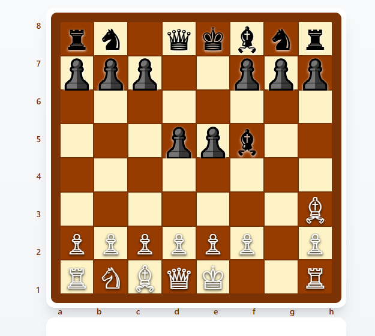
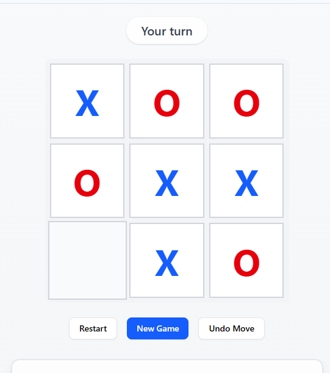
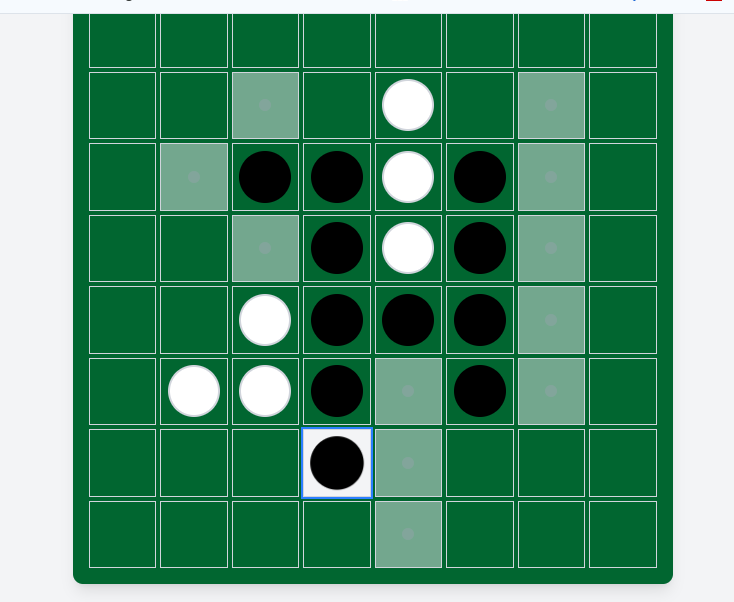

# 🎮 AI Games Collection

This project features three classic AI-powered games:
- ♟️ **Chess**
- ❌⭕ **Tic-Tac-Toe**
- ⚫⚪ **Reversi (Othello)**

## 🚀 Live Demo

You can try out the AI Games project live here:  
👉 [https://ai-games-bytecrister.vercel.app](https://ai-games-bytecrister.vercel.app)


Built with:
- **Next.js 15+**
- **React 19**
- **TypeScript**
- **Tailwind CSS**
- **shadcn/ui**

---

## 🚀 How to Run the Project

1. Navigate to the `ai-games` folder:
   ```bash
   cd ai-games
   ```

2. Install dependencies:
   ```bash
   npm install
   ```

3. Start the development server:
   ```bash
   npm run dev
   ```

4. Open your browser at `http://localhost:3000`

---

## 🛠 Prerequisites and Setup

- **Node.js** (v18+)
- **npm** or **yarn**
- **Frameworks/Libraries:**
  - Next.js
  - React
  - TypeScript
  - Tailwind CSS
  - shadcn/ui

### Tailwind CSS Setup
Tailwind is already configured in the project with `globals.css` and `tailwind.config.ts`.

### shadcn/ui Setup
shadcn/ui is pre-configured for UI components like buttons, dialogs, and forms. You can customize components in `/src/components/ui`.

If you need to add new shadcn components:
```bash
npx shadcn-ui@latest add [component-name]
```

---

## 📚 Game Details

<details>
<summary>♟️ <strong>Chess</strong></summary>

### How to Play:
- Choose a difficulty level: Easy, Medium, or Hard.
- Play against AI following standard chess rules.
- Objective: Checkmate the opponent’s king.

### AI Algorithm:
- **Name:** Alpha-Beta Pruning
- **Use Cases:** Chess engines, decision-making systems.
- **Time Complexity:**
  - **Best:** O(b^(d/2)) with good move ordering
  - **Average:** O(b^d)
  - **Worst:** O(b^d)
  - `b`: branching factor (~35), `d`: search depth.

### Screenshot:


</details>

---

<details>
<summary>❌⭕ <strong>Tic-Tac-Toe</strong></summary>

### How to Play:
- Choose a difficulty level.
- Play on a 3x3 grid, align 3 symbols in a row/column/diagonal.
- Objective: Win or block the opponent.

### AI Algorithm:
- **Name:** Minimax
- **Use Cases:** Simple games, optimal decision making.
- **Time Complexity:**
  - **Best:** O(1) (immediate win/block)
  - **Average:** O(b^d)
  - **Worst:** O(b^d)
  - `b`: branching factor (9), `d`: depth (max 9).

### Screenshot:


</details>

---

<details>
<summary>⚫⚪ <strong>Reversi (Othello)</strong></summary>

### How to Play:
- Choose a difficulty level.
- Place discs to flip opponent’s pieces.
- Objective: Capture most discs by endgame.

### AI Algorithm:
- **Name:** Alpha-Beta Pruning
- **Use Cases:** Reversi engines, board games.
- **Time Complexity:**
  - **Best:** O(b^(d/2)) with good move ordering
  - **Average:** O(b^d)
  - **Worst:** O(b^d)
  - `b`: branching factor (~8), `d`: search depth.

### Screenshot:


</details>

---

## 📂 Project Structure

```
ai-games/
├── public/
│   └── images/
│       ├── chess.png
│       ├── reversi.png
│       └── tic-tac-toe.png
│
└── src/
    ├── app/
    │   ├── globals.css
    │   ├── layout.tsx
    │   ├── loading.tsx
    │   ├── page.tsx
    │   ├── chess/
    │   │   ├── loading.tsx
    │   │   ├── page.tsx
    │   │   └── [difficulty]/
    │   │       ├── loading.tsx
    │   │       └── page.tsx
    │   ├── reversi/
    │   │   ├── loading.tsx
    │   │   ├── page.tsx
    │   │   └── [difficulty]/
    │   │       ├── loading.tsx
    │   │       └── page.tsx
    │   └── tic-tac-toe/
    │       ├── loading.tsx
    │       ├── page.tsx
    │       └── [difficulty]/
    │           ├── loading.tsx
    │           └── page.tsx
    │
    ├── components/
    │   ├── chess/
    │   │   ├── AI.ts
    │   │   ├── ChessBoard.tsx
    │   │   ├── ChessDifficulty.tsx
    │   │   ├── ChessGame.tsx
    │   │   ├── GameControls.tsx
    │   │   ├── GameLogic.ts
    │   │   ├── GameOverModal.tsx
    │   │   ├── Square.tsx
    │   │   ├── types.ts
    │   │   └── useChessGame.ts
    │   ├── home/
    │   │   ├── GameCard.tsx
    │   │   ├── GameSelector.tsx
    │   │   └── types.ts
    │   ├── loaders/
    │   │   ├── loader-one.module.css
    │   │   └── LoaderOne.tsx
    │   ├── reversi/
    │   │   ├── AILogic.ts
    │   │   ├── Board.tsx
    │   │   ├── Cell.tsx
    │   │   ├── DifficultySelector.tsx
    │   │   ├── GameControls.tsx
    │   │   ├── GameLogic.ts
    │   │   ├── Reversi.tsx
    │   │   ├── ReversiDifficulty.tsx
    │   │   ├── ScoreBoard.tsx
    │   │   ├── types.ts
    │   │   └── useReversiGame.ts
    │   ├── tic-tac-toe/
    │   │   ├── DifficultySelector.tsx
    │   │   ├── GameBoard.tsx
    │   │   ├── GameLogic.ts
    │   │   ├── GamePage.tsx
    │   │   ├── GameSquare.tsx
    │   │   ├── ScorePanel.tsx
    │   │   ├── TicTacToe.tsx
    │   │   ├── types.ts
    │   │   └── useTicTacToe.ts
    │   └── ui/
    │       ├── alert.tsx
    │       ├── button.tsx
    │       ├── card.tsx
    │       ├── dialog.tsx
    │       ├── label.tsx
    │       ├── radio-group.tsx
    │       └── select.tsx
    │
    └── lib/
        └── utils.ts

```

## 💡 Features Overview

- 🎯 Difficulty selection for all games

- 🤖 Smart AI algorithms (Minimax & Alpha-Beta Pruning)

- 🌐 Fully responsive design with Tailwind

- 🧩 Modular and maintainable architecture


## 📬 Feedback & Contributions

Pull requests and stars are welcome!
If you'd like to contribute or have suggestions, feel free to open an issue.